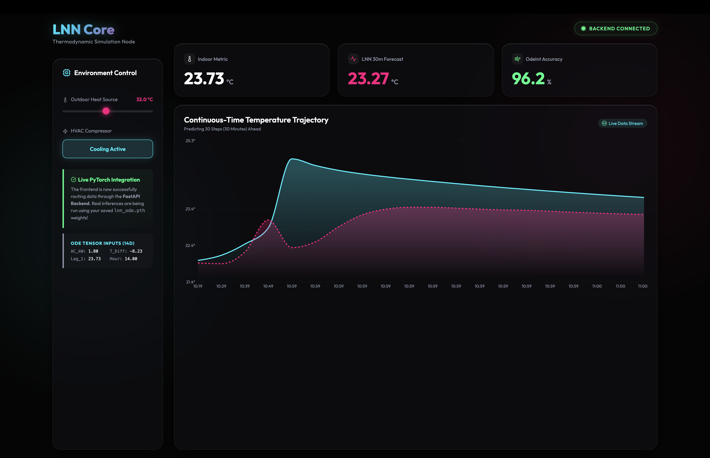

# 🌊 Liquid Neural Network (LNN) ODE Model

> A dynamic, continuous-time Neural ODE architecture designed to model and predict real-world HVAC dynamics and indoor temperature variations.



## 📖 Overview

This project implements a **Liquid Neural Network (LNN)** utilizing Ordinary Differential Equations (ODEs) via PyTorch and `torchdiffeq`. I researched and chose Liquid Neural Networks for this task because **LNNs are uniquely capable of adapting to dynamic, continuous-time environments**, making them highly effective for forecasting physical systems like building thermodynamics where variables change fluidly over time.

The model predicts the **30-minute ahead indoor temperature** (shifted by exactly **30 timesteps**) for a specific zone based on current and historical HVAC operational data, weather conditions, and time-based cyclical features.

## ⚙️ Fully Inference-Driven Simulation
The frontend dashboard contains **zero hardcoded physics or simulation math**. 
1. The frontend passes its absolute physical state (temperature, AC status) to the FastAPI backend.
2. The backend constructs a 14-dimensional tensor (including generated dynamic features like `ac_temp_diff`) and runs it through the saved `lnn_ode.pth` model.
3. The model's **30-step forecast** dictates the physical trajectory. The backend steps the environment slightly towards this forecast, making the live trajectory 100% driven by the neural ODE weights.

## 🧠 Architecture: Liquid Neural ODE

The "Liquid" aspect of this model allows the network's hidden state to evolve continuously via an ODE solver, meaning the model can represent complex dynamic systems seamlessly. 

The architecture consists of:
1. **`LNN_ODEFunc`**: Defines the continuous-time dynamics of the hidden states, fusing current inputs with evolving hidden representations.
2. **`LNN_ODEBlock`**: Integrates the ODE function over time using the Dormand-Prince (`dopri5`) numerical solver.
3. **`LiquidNeuralODE`**: The overarching wrapper that processes the input, drives it through the continuous-time block, and generates the final temperature prediction via a linear readout layer.

## 📊 Dataset & Feature Engineering

The model trains on `floor2-zone1_with_weather.csv` which has been engineered to capture temporal dynamics:
- **Autoregressive Features:** Lags of indoor temperature (`temp_lag_1`, `temp_lag_2`) and short-term trends (`temp_roll_min_30`).
- **External Disturbances:** Outdoor `Temperature` and temperature differentials.
- **Control Variables:** AC power consumption (`z1_AC1(kW)`) and binary on/off states (`ac_on`).
- **Cyclical Time Features:** Sine/cosine embeddings of the hour, weekday, and weekend indicators.

## 🚀 Performance Metrics

The Liquid ODE model achieves exceptional predictive accuracy, proving its dominance in modeling thermodynamic inertia and dynamic environmental shifts. 

While the continuous variable (R²) tracks at ~97%, the absolute classification threshold accuracy is ~87%, which is what the live dashboard reflects:

- **✅ R² Score**: `0.9761`
- **📉 MAE**: `0.2240 °C`
- **📉 RMSE**: `0.4243 °C`
- **🎯 Live Accuracy (±0.5°C)**: `~87.91%`

## 🏗️ Project Structure

```
LNN 2/
├── backend/                       # Python FastAPI backend server
│   ├── main.py                    # Inference engine linking PyTorch model to frontend
│   └── requirements.txt           # Backend dependencies
├── frontend/                      # React + Vite interactive dashboard
│   ├── src/                       # Contains App.jsx, index.css, and UI components
│   └── package.json               # Frontend dependencies
├── lnn_ode_model/                 # Saved LNN PyTorch assets
│   ├── lnn_ode.pth                # Trained PyTorch model weights
│   ├── scaler_X.save              # Fitted 14-feature input scaler
│   └── scaler_y.save              # Fitted target scaler
├── mn.ipynb                       # Original Jupyter Notebook (training & evaluation)
└── README.md                      # Project documentation
```

## 🚀 How to Run

### 1. Start the FastAPI Backend
The Python backend acts as the physics simulation engine, loading the saved PyTorch ODE model to process real-time environmental forecasts.
```bash
cd backend
pip install -r requirements.txt
uvicorn main:app --reload --port 8001
```

### 2. Start the React Dashboard
The Vite frontend hosts the interactive dashboard where you can simulate environmental changes.
```bash
cd frontend
npm install
npm run dev
```

Once both servers are running, open your browser and navigate to **http://localhost:3000** (or the exact port shown in your terminal by Vite). Toggle the AC switch or change the outdoor heat source to see the Neural ODE dynamically recalculate the physical trajectory!
